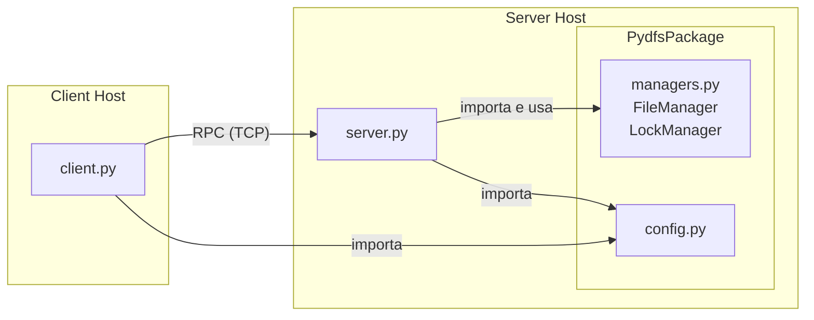

# PyDFS: Python Distributed File System

PyDFS è un'applicazione Client-Server distribuita che simula un file system remoto condiviso. Permette agli utenti di caricare, scaricare e gestire file su un server centrale, garantendo la consistenza dei dati tramite un meccanismo di locking.

## Caratteristiche Principali

* **Gestione File Remota:** Operazioni di list, upload, download e delete.
* **Gestione Consistenza:** Un `LockManager` sul server previene modifiche concorrenti allo stesso file.
* **Trasferimento a Blocchi:** I file sono trasferiti in blocchi (chunks) per ottimizzare l'uso della memoria.
* **Interfaccia CLI:** Un client interattivo basato su riga di comando per l'interazione utente.

## Architettura

Il sistema si basa su un'architettura Client-Server e utilizza `multiprocessing.managers` di Python per le comunicazioni RPC (Remote Procedure Call).

* **Server (`server.py`):**
  * Espone `FileManager` (gestione delle operazioni su disco in `server_storage/`) e `LockManager` (gestione dei lock sui file) tramite RPC.
* **Client (`client.py`):**
  * Fornisce una shell interattiva che permette di eseguire comandi come `ls`, `up`, `down`, `rm`.

### Diagramma Architetturale

Il diagramma seguente descrive la struttura dei componenti principali del progetto.



## Come Usare

### Avviare il Server

1. Apri un terminale.
2. Esegui il server:

    ```bash
    python server.py
    ```

    Il server si avvierà sulla porta `50005` e creerà una directory `server_storage/` se non esiste.

### Avviare il Client

1. Apri un secondo terminale.
2. Esegui il client:

    ```bash
    python client.py
    ```

3. Usa i seguenti comandi nella shell interattiva:
    * `ls`: Elenca i file sul server.
    * `up <percorso_file_locale>`: Carica un file dal tuo sistema locale al server.
    * `down <nome_file_remoto>`: Scarica un file dal server al tuo sistema locale.
    * `rm <nome_file_remoto>`: Elimina un file dal server.
    * `exit`: Esci dal client.

## Verifica del Funzionamento

Per verificare rapidamente il corretto funzionamento del DFS, è possibile eseguire la suite di test inclusa nel progetto. Questi test avviano automaticamente il server, eseguono una serie di operazioni (upload, list, download, delete) e ne verificano l'esito.

**ATTENZIONE:** I test creano e modificano le directory `server_storage/` e `client_storage/`.

Per impostazione predefinita, al termine dei test, le cartelle **non vengono eliminate** per permettere l'ispezione manuale dei file creati.

### Esecuzione dei Test

1.  Apri un terminale.
2.  Esegui lo script:
    ```bash
    python test_project.py
    ```
    Verrà visualizzato l'output dei test. Le cartelle `server_storage` e `client_storage` conterranno i file generati dall'ultimo test eseguito.

### Esecuzione con Pulizia Automatica

Per eseguire i test e fare in modo che le cartelle di storage vengano eliminate automaticamente al termine, usa l'opzione `--cleanup`:

```bash
python test_project.py --cleanup
```

## Tecnologie

* **Linguaggio:** Python 3.x
* **Middleware RPC:** `multiprocessing.managers` (libreria standard Python)
* **Protocollo:** TCP/IP (gestito implicitamente dal manager)
